  

  <picture>
    <source media="(prefers-color-scheme: dark)" srcset="https://readme-typing-svg.demolab.com?font=JetBrains+Mono&weight=500&size=20&duration=3200&pause=900&color=FCF1D0&center=true&vCenter=true&width=620&height=40&lines=Desenvolvedor+Full+Stack;Python+e+Django+no+backend;React+e+React+Native+na+tela;Aplica%C3%A7%C3%B5es+de+IA">
    
  </picture>

 

## Sobre mim

Sou desenvolvedor full stack na **InterTV**, afiliada da Rede Globo no Rio de Janeiro. Atuo no backend, com APIs em Django, microsserviços, banco de dados, filas e containers, frontend utilizando React e também desenvolvo apps mobile em React Native.

Nos últimos meses tenho mergulhado em fluxos de agentes de IA rodando localmente e em observabilidade: medir o sistema antes de tentar melhorar.

 

## Tecnologias

<table align="center">
  <tr>
    <td align="right" width="120"><b>BACKEND</b></td>
    <td align="center" width="96"> Python</td>
    <td align="center" width="96"> Django</td>
    <td align="center" width="96"> FastAPI</td>
    <td width="96"></td>
  </tr>
  <tr>
    <td align="right"><b>WEB & MOBILE</b></td>
    <td align="center"> React · Native</td>
    <td align="center"> JavaScript</td>
    <td align="center"> Next.js</td>
    <td></td>
  </tr>
  <tr>
    <td align="right"><b>DADOS</b></td>
    <td align="center"> PostgreSQL</td>
    <td align="center"> Redis</td>
    <td align="center"> Supabase</td>
    <td></td>
  </tr>
  <tr>
    <td align="right"><b>INFRA</b></td>
    <td align="center"> Docker</td>
    <td align="center"> Linux</td>
    <td align="center"> Nginx</td>
    <td align="center"> Prometheus</td>
  </tr>
</table>

 

## Projetos

<table>
  <tr>
    <td width="50%" valign="top">
      
      <h3>IRIS</h3>
      
Plataforma de monitoramento e curadoria de notícias com IA, feita para apoiar o trabalho da redação. Atuo no backend, nos microsserviços e na infraestrutura.

      

        
        
        
        
        
        
      

    </td>
    <td width="50%" valign="top">
      
      <h3>IRIS Mobile</h3>
      
App para a equipe acompanhar notícias e alertas direto do celular, conectado ao mesmo backend da plataforma.

      

        
        
      

    </td>
  </tr>
</table>

 

## No GitHub

  
  

  

  

  <picture>
    <source media="(prefers-color-scheme: dark)" srcset="https://raw.githubusercontent.com/LipeVaz/LipeVaz/output/snake-dark.svg">
    
  </picture>

 

## Onde me encontrar

  
  

 

  

  <b>FELLIPE VAZ</b> · Saquarema, RJ
   
  Fim da transmissão · Obrigado pela visita!

