<p align="center">
  
</p>

<p align="center">
  <picture>
    <source media="(prefers-color-scheme: dark)" srcset="https://readme-typing-svg.demolab.com?font=JetBrains+Mono&weight=500&size=20&duration=3200&pause=900&color=FCF1D0&center=true&vCenter=true&width=620&height=40&lines=Desenvolvedor+Full+Stack;Python+e+Django+no+backend;React+e+React+Native+na+tela;IA+aplicada+ao+jornalismo+regional;Do+servidor+ao+celular">
    
  </picture>
</p>

<br>

## Sobre mim

Sou desenvolvedor full stack na **InterTV**, afiliada da Globo no interior do Rio. Passo a maior parte do tempo no backend, com APIs em Django, microsserviços, banco de dados, filas e containers, e também desenvolvo app mobile em React Native.

Hoje meu foco é o **IRIS**, uma plataforma interna que usa IA para ajudar a redação a acompanhar o que acontece na região. É software que roda todo dia na mão de jornalistas, então estabilidade vem antes de qualquer firula.

Nos últimos meses tenho mergulhado em agentes de IA rodando localmente e em observabilidade: medir o sistema antes de tentar melhorar.

```text
base      Região dos Lagos, RJ
trabalho  InterTV · tecnologia
stack     Python · Django · React · React Native
agora     agentes de IA locais · observabilidade · mobile
```

<br>

## Tecnologias

<p align="center">
  <picture>
    <source media="(prefers-color-scheme: dark)" srcset="https://skillicons.dev/icons?i=python,django,react,js&theme=dark">
    
  </picture>
  <br>
  <sub>React na web e React Native no mobile</sub>
</p>

<p align="center">
  <sub>também no dia a dia</sub>
  <br><br>
  <picture>
    <source media="(prefers-color-scheme: dark)" srcset="https://skillicons.dev/icons?i=fastapi,postgres,redis,docker,nginx,linux,nextjs,supabase,prometheus,git&theme=dark&perline=10">
    
  </picture>
</p>

<br>

## Projetos

<table>
  <tr>
    <td width="50%" valign="top">
      
      <h3>IRIS</h3>
      <p>Plataforma de monitoramento e curadoria de notícias com IA, feita para apoiar o trabalho da redação. Atuo no backend, nos microsserviços e na infraestrutura.</p>
      <p>
        
        
        
        
        
        
      </p>
    </td>
    <td width="50%" valign="top">
      
      <h3>IRIS Mobile</h3>
      <p>App para a equipe acompanhar notícias e alertas direto do celular, conectado ao mesmo backend da plataforma.</p>
      <p>
        
        
      </p>
    </td>
  </tr>
  <tr>
    <td colspan="2" valign="top">
      
      <h3>Plataforma de Gestão Executiva</h3>
      <p>Aplicação web interna. Desenvolvi o fluxo de autenticação em dois fatores (MFA) para administradores.</p>
      <p>
        
        
      </p>
    </td>
  </tr>
</table>

<br>

## No GitHub

<p align="center">
  
  
</p>

<p align="center">
  
</p>

<p align="center">
  
</p>

<p align="center">
  
</p>

<p align="center">
  <picture>
    <source media="(prefers-color-scheme: dark)" srcset="https://raw.githubusercontent.com/LipeVaz/LipeVaz/output/snake-dark.svg">
    
  </picture>
</p>

<br>

## Onde me encontrar

<p align="center">
  <a href="https://www.linkedin.com/in/fellipevaz/"></a>
  <a href="https://www.instagram.com/lipez_vaz/"></a>
</p>

<br>

<p align="center">
  
</p>

<p align="center">
  <sub><b>FELLIPE VAZ</b> · Região dos Lagos, RJ</sub>
  <br>
  <sub>fim da transmissão · obrigado pela visita</sub>
</p>